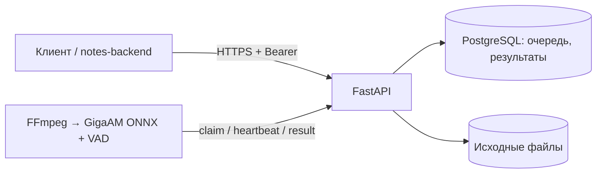

# GigaAM API

Независимый сервис распознавания русской речи: HTTP API принимает аудио, видео или прямую
ссылку на медиафайл, отдельный worker получает задачу и возвращает текст с таймкодами.
Worker сам подключается к API; входящий порт и доступ к PostgreSQL ему не нужны.

Это самостоятельный проект, а не форк GigaAMGUI. Используются GigaAM через `onnx-asr`
и Silero VAD; код GUI не включён. См. [сторонние компоненты](THIRD_PARTY.md).



## Возможности v0.1

- Файлы WAV, MP3, M4A, MP4, MOV, AAC, OGG, Opus, FLAC, WebM, MKV; декодирование через FFmpeg.
- Прямые HTTP(S)-ссылки на файл; проверка DNS, адресов и каждого redirect, подключение к проверенному IP.
- Русская расшифровка, сегменты и таймкоды, статусы задач, ручной retry и удаление.
- Очередь в БД, атомарная выдача, lease на 120 секунд, heartbeat каждые 25 секунд.
  После падения worker задачу можно забрать повторно. Поздний ответ со старым lease отклоняется.
- `Idempotency-Key`, изоляция владельцев, отдельный worker-токен, ограничения размера и длительности.
- PostgreSQL + Alembic для запуска сервиса, SQLite для локальной разработки.

Страницы YouTube/VK и плейлисты в этой версии не поддерживаются. Нужен загружаемый файл
или прямая ссылка на него. Диаризации говорящих нет; `speaker` зарезервирован и обычно `null`.

## Быстрый запуск

Нужны Docker Engine и Compose. Один раз создайте общую сеть:

```sh
docker network create voice-notes
cp .env.example .env
```

В `.env` замените три примера секретов. Для каждого токена/пароля сгенерируйте отдельное
значение командой `python3 -c 'import secrets; print(secrets.token_urlsafe(32))'`.
`ASR_API_KEYS` — JSON `{"длинный-токен-клиента":"стабильный-id-владельца"}`.
Ключ этой записи затем используется как `ASR_CLIENT_TOKEN` в notes-backend.

```sh
# API + PostgreSQL; обработчик будет на другой машине
docker compose up -d --build

# Или полный сервис вместе с CPU-обработчиком
docker compose --profile local-worker up -d --build
```

Swagger: <http://localhost:8100/docs>. Порты опубликованы только на loopback.
Для удалённого доступа нужен HTTPS reverse proxy. Встроенной TLS-терминации нет.
Первое реальное задание загружает модель и VAD из Hugging Face; скачивание и загрузка
модели могут занять время. Кэш хранится в volume `models`.

Удалённый worker: соберите `docker build --target worker -t gigaam-worker .`, затем
запустите образ с `ASR_API_URL=https://адрес-api`, `ASR_WORKER_TOKEN` и volume `/models`.
Параметры worker: `ASR_MODEL=gigaam-v3-e2e-rnnt`, `ASR_QUANTIZATION=int8`,
`MAX_AUDIO_SECONDS=14400`. В v0.1 используется CPUExecutionProvider.

## Использование API

```sh
export ASR_TOKEN='ваш-токен-клиента'
curl -H "Authorization: Bearer $ASR_TOKEN" \
  -H 'Idempotency-Key: recording-001' \
  -F file=@recording.m4a http://localhost:8100/v1/transcriptions
```

Ответ `202`: `{id, state: "queued", ...}`. Проверяйте
`GET /v1/transcriptions/{id}`, затем `GET /v1/transcriptions/{id}/result`.
До готовности result возвращает `409`. После удаления все пользовательские чтения — `404`.
Повтор запроса с тем же ключом и содержимым возвращает ту же задачу;
с другим содержимым — `409`. Ключ удалённой задачи не переиспользуется.

| Метод | Путь | Назначение |
|---|---|---|
| POST | `/v1/transcriptions` | Multipart, поле `file` |
| POST | `/v1/imports` | JSON `{"url":"https://…/audio.mp3"}` |
| GET | `/v1/transcriptions/{id}` | Статус, попытки, код ошибки |
| GET | `/v1/transcriptions/{id}/result` | Текст и сегменты |
| POST | `/v1/transcriptions/{id}/retry` | Повтор задачи в состоянии failed |
| DELETE | `/v1/transcriptions/{id}` | Удалить источник и результат |

Контракт: [OpenAPI](docs/openapi.json). Время создания/обновления — Unix seconds UTC;
таймкоды — секунды от начала аудио. Пример результата:

```json
{"language":"ru","model":"gigaam-v3-e2e-rnnt","duration":4.2,"text":"Обсудили релиз.",
 "segments":[{"id":"s0","start":0.4,"end":2.1,"text":"Обсудили релиз.","speaker":null}]}
```

## Эксплуатация и ограничения

По умолчанию максимум 256 MiB и 4 часа. Это ограничения продукта, а не обещание скорости:
память и время GigaAM необходимо измерить на выбранной машине и реальных записях.
Декодированное трёхчасовое аудио занимает заметно больше места, чем сжатый исходник.

`/healthz` проверяет API и БД; это не проверка присутствия worker и скачанной модели.
Ошибки декодирования терминальные; временные ошибки повторяются до трёх попыток.
Обработка имеет семантику at-least-once: после сбоя вычисление может повториться,
но только обладатель актуального lease может сохранить результат.

Содержимое хранится до DELETE; автоматической retention-политики пока нет. Удаление не
стирает копии в backup и уже выданный worker временный файл до завершения его задачи.
Для живого сервиса: HTTPS, ограничения размера тела и частоты запросов на proxy, закрытая БД,
мониторинг очереди/свободного диска, согласованный срок хранения и проверяемые backup.
Логи приложения не содержат расшифровки, токены и исходные URL; настройте proxy аналогично.

Compose запускает миграции перед API. Обновление схемы — `alembic upgrade head`;
на существующей SQLite-базе, созданной ранним запуском приложения без Alembic, перед первым
`alembic stamp 0001` нужно проверить совпадение схемы. Для новых установок используйте миграции сразу.
Не запускайте downgrade на живой базе без проверенного backup.

В тестах используются тестовые распознаватели; модельные веса не скачиваются, точность ASR
не оценивается. Инструкции и CI: [CONTRIBUTING.md](CONTRIBUTING.md).
