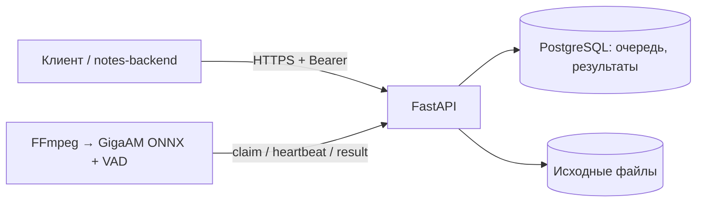

# GigaAM API

Независимый сервис распознавания русской речи: HTTP API принимает аудио, видео, прямую
ссылку на медиафайл или ссылку на публичный ролик YouTube/VK. Отдельный worker получает
задачу и возвращает текст с таймкодами.
Worker сам подключается к API; входящий порт и доступ к PostgreSQL ему не нужны.

Это самостоятельный проект, а не форк GigaAMGUI. Используются GigaAM через `onnx-asr`
и Silero VAD; код GUI не включён. См. [сторонние компоненты](THIRD_PARTY.md).


```mermaid
flowchart LR
    Client[Клиент / notes-backend] -->|HTTPS + Bearer| API[FastAPI]
    API --> DB[(PostgreSQL: очередь, результаты)]
    API --> Files[(Исходные файлы)]
    Worker[FFmpeg → GigaAM ONNX + VAD] -->|claim / heartbeat / result| API
```

## Возможности v0.1

- Файлы WAV, MP3, M4A, MP4, MOV, AAC, OGG, Opus, FLAC, WebM, MKV; декодирование через FFmpeg.
- Прямые HTTP(S)-ссылки на файл; проверка DNS, адресов и каждого redirect, подключение к проверенному IP.
- Публичные одиночные ролики YouTube/VK, для которых доступен прямой HTTPS-аудио/видеофайл.
- Русская расшифровка, сегменты и таймкоды, статусы задач, ручной retry и удаление.
- Очередь в БД, атомарная выдача, lease на 120 секунд, heartbeat каждые 25 секунд.
  После падения worker задачу можно забрать повторно. Поздний ответ со старым lease отклоняется.
- `Idempotency-Key`, изоляция владельцев, отдельный worker-токен, ограничения размера и длительности.
- PostgreSQL + Alembic для запуска сервиса, SQLite для локальной разработки.

Плейлисты, каналы, текущие эфиры, DRM и ролики, требующие входа/cookies, не поддерживаются.
Если платформа отдаёт только HLS/DASH-фрагменты, используйте загрузку файла. Доступность
конкретного видео зависит от платформы, региона и доступных форматов. Диаризации говорящих
нет; `speaker` зарезервирован и обычно `null`.

## Быстрый запуск

Нужны Docker Engine и Compose. Один раз создайте общую сеть:

```sh
docker network create voice-notes
cp .env.example .env
```

В `.env` замените три примера секретов. Для каждого токена/пароля сгенерируйте отдельное
значение командой `python3 -c 'import secrets; print(secrets.token_urlsafe(32))'`.
`ASR_API_KEYS` — JSON `{"длинный-токен-клиента":"стабильный-id-владельца"}`.
Ключ этой записи затем используется как `ASR_CLIENT_TOKEN` в notes-backend.

```sh
# API + PostgreSQL; обработчик будет на другой машине
docker compose up -d --build

# Или полный сервис вместе с CPU-обработчиком
docker compose --profile local-worker up -d --build
```

Swagger: <http://localhost:8100/docs>. Порты опубликованы только на loopback.
Для удалённого доступа нужен HTTPS reverse proxy. Встроенной TLS-терминации нет.
Первое реальное задание загружает модель и VAD из Hugging Face; скачивание и загрузка
модели могут занять время. Кэш хранится в volume `models`.

Для отдельного worker на Mac скопируйте `worker.env.example` в `.env.worker`, укажите
HTTPS-адрес API (включая префикс пути, если есть) и его отдельный worker-токен:

```sh
# Создать кэш, если его ещё нет; прежний volume можно указать в ASR_MODEL_VOLUME.
docker volume create gigaam-api_models
docker compose --env-file .env.worker -f compose.worker.yaml up -d --build
```

Этот Compose запускает только вычислительный worker. База, API и входящий порт на Mac
не нужны. Он использует существующий кэш моделей; API сохраняет задания, пока Mac спит
или Docker Desktop остановлен. Возобновление требует работающего Docker Desktop.

Параметры worker: `ASR_MODEL=gigaam-v3-e2e-rnnt`, `ASR_QUANTIZATION=int8`,
`MAX_AUDIO_SECONDS=14400`. В v0.1 используется CPUExecutionProvider.

Worker image также собирается для Linux ARM64 и может работать на Raspberry Pi с
64-битной ОС. Для управляемого временного хранилища задайте `ASR_SCRATCH_DIR=/scratch`
и подключите отдельный дисковый volume с правом записи UID/GID 10001/10001. При запуске
worker удаляет оставшиеся `gigaam-*` каталоги, предварительно блокируя этот scratch.
Используйте отдельный volume на каждый worker, общий кэш моделей `/models` можно сохранить.

## Использование API

```sh
export ASR_TOKEN='ваш-токен-клиента'
curl -H "Authorization: Bearer $ASR_TOKEN" \
  -H 'Idempotency-Key: recording-001' \
  -F file=@recording.m4a http://localhost:8100/v1/transcriptions
```

Ответ `202`: `{id, state: "queued", ...}`. Проверяйте
`GET /v1/transcriptions/{id}`, затем `GET /v1/transcriptions/{id}/result`.
До готовности result возвращает `409`. После удаления все пользовательские чтения — `404`.
Повтор запроса с тем же ключом и содержимым возвращает ту же задачу;
с другим содержимым — `409`. Ключ удалённой задачи не переиспользуется.

| Метод | Путь | Назначение |
|---|---|---|
| POST | `/v1/transcriptions` | Multipart, поле `file` |
| POST | `/v1/imports` | JSON с прямой ссылкой или ссылкой на публичный ролик YouTube/VK |
| GET | `/v1/transcriptions/{id}` | Статус, попытки, код ошибки |
| GET | `/v1/transcriptions/{id}/result` | Текст и сегменты |
| POST | `/v1/transcriptions/{id}/retry` | Повтор задачи в состоянии failed |
| DELETE | `/v1/transcriptions/{id}` | Удалить источник и результат |
| DELETE | `/v1/requests/{idempotency_key}` | Отменить загрузку даже при потере ответа с job ID |

Отмена по ключу создаёт tombstone: последующие загрузки с этим ключом отклоняются.
Это позволяет notes-backend удалить источник при сбое между приёмом файла ASR и сохранением его ID.
DELETE можно безопасно повторять, в том числе после временной ошибки файловой системы.

### Импорт страниц видео

Примеры форм ссылок: `https://www.youtube.com/watch?v=VIDEO_ID`,
`https://youtu.be/VIDEO_ID`, `https://www.youtube.com/shorts/VIDEO_ID`,
`https://vk.com/video-OWNER_ID_VIDEO_ID`, `https://vkvideo.ru/video-OWNER_ID_VIDEO_ID`.
В обработку передаётся только канонический адрес одиночного видео; параметры плейлиста
и access keys отбрасываются. Сначала выбирается аудиодорожка, затем при необходимости
небольшой видеофайл с аудио.

Worker запускает закреплённый `yt-dlp` только для извлечения метаданных. Дочерний процесс
получает отдельный временный HOME и минимальное окружение без ключей ASR/LLM. Пользовательские
config, plugins, cookies и загрузка дополнительных remote components отключены. Запросы
extractor идут через временный loopback-прокси: он проверяет публичность всех DNS-ответов
и подключается к проверенному IP для каждого HTTP-запроса/HTTPS CONNECT. Прокси ограничен
90 секундами, 64 запросами и 32 MiB трафика; stdout/stderr процесса — суммарно 2 MiB.
Это ограничение доверенного extractor-процесса, а не универсальная OS-песочница.

Сам медиафайл скачивает существующий downloader с обычным лимитом размера и защитой
redirect/DNS. В FFmpeg передаётся только локальный файл. Для YouTube в worker установлены
`yt-dlp-ejs` и Deno; браузерные cookies не используются.

Для медленного источника общий бюджет загрузки — 30 минут (`MEDIA_DOWNLOAD_TIMEOUT=1800`,
допустимо 1–3600 секунд); лимит размера остаётся прежним. Он включает перенаправления,
но не извлечение метаданных и не распознавание. Ожидание отдельной сетевой операции
ограничено 20 секундами. Это заменяет прежний фиксированный лимит в пять минут,
которого не хватало даже для 32-минутного ролика при медленной выдаче аудио YouTube.
Загрузка после превышения времени не передаётся распознавателю.

Коды ошибок: `unsupported_source` — неподдерживаемый тип страницы/эфир/DRM;
`unsupported_duration` — неизвестная или слишком большая длительность;
`unsupported_video_format` — нет подходящего прямого файла;
`page_import_timeout`/`page_import_limit` — превышен лимит извлечения метаданных;
`page_import_failed` — платформа или extractor не предоставили результат. Они терминальные,
после исправления причины можно сделать явный retry. В тестах ответы видеоплатформ подменены;
они не гарантируют доступность конкретного ролика с вашей машины.

Сбой скачивания медиа возвращает отдельный код: `download_timeout` — превышено время,
`download_too_large` — размер, `download_failed` — источник ответил ошибкой.
Эти ошибки не обозначаются как повреждённое аудио; повтор выполняется явно через retry.

Контракт: [OpenAPI](docs/openapi.json). Время создания/обновления — Unix seconds UTC;
таймкоды — секунды от начала аудио. Пример результата:

```json
{"language":"ru","model":"gigaam-v3-e2e-rnnt","duration":4.2,"text":"Обсудили релиз.",
 "segments":[{"id":"s0","start":0.4,"end":2.1,"text":"Обсудили релиз.","speaker":null}]}
```

## Эксплуатация и ограничения

По умолчанию максимум 256 MiB и 4 часа. Это ограничения продукта, а не обещание скорости:
память и время GigaAM необходимо измерить на выбранной машине и реальных записях.
Декодированное трёхчасовое аудио занимает заметно больше места, чем сжатый исходник.

`/healthz` проверяет API и БД; это не проверка присутствия worker и скачанной модели.
Журнал worker содержит время начала, скачивания, декодирования, загрузки модели и
распознавания. `realtime_factor` — время распознавания, делённое на длительность аудио;
меньше 1 означает быстрее реального времени. Общая длительность job включает также
скачивание и подготовку. Логи не содержат текст, URL записи или токены. Для оценки
нагрева на Raspberry Pi необходимо параллельно собирать температуру и флаги throttling
на хосте; длительность обработки сама по себе этого не показывает.
Ошибки декодирования терминальные; временные ошибки повторяются до трёх попыток.
Обработка имеет семантику at-least-once: после сбоя вычисление может повториться,
но только обладатель актуального lease может сохранить результат.

Загруженный исходник автоматически удаляется после `completed` или окончательного
`failed`; результат и метаданные остаются до DELETE. Ожидающая автоматического повтора
задача сохраняет исходник. После удаления файла retry возвращает `409 source_media_deleted`:
загрузите файл заново с новым ключом идемпотентности. URL-задание можно повторить через retry.
Ошибки удаления записываются в очередь очистки и проверяются при следующих обращениях
worker; перезапуск API также повторяет очистку. Удаление не стирает копии в backup и
уже выданный worker временный файл до завершения его задачи.
Для живого сервиса: HTTPS, ограничения размера тела и частоты запросов на proxy, закрытая БД,
мониторинг очереди/свободного диска, согласованный срок хранения и проверяемые backup.
Логи приложения не содержат расшифровки, токены и исходные URL; настройте proxy аналогично.

Compose запускает миграции перед API. Обновление схемы — `alembic upgrade head`;
на существующей SQLite-базе, созданной ранним запуском приложения без Alembic, перед первым
`alembic stamp 0001` нужно проверить совпадение схемы. Для новых установок используйте миграции сразу.
Не запускайте downgrade на живой базе без проверенного backup.

В тестах используются тестовые распознаватели; модельные веса не скачиваются, точность ASR
не оценивается. Инструкции и CI: [CONTRIBUTING.md](CONTRIBUTING.md).
